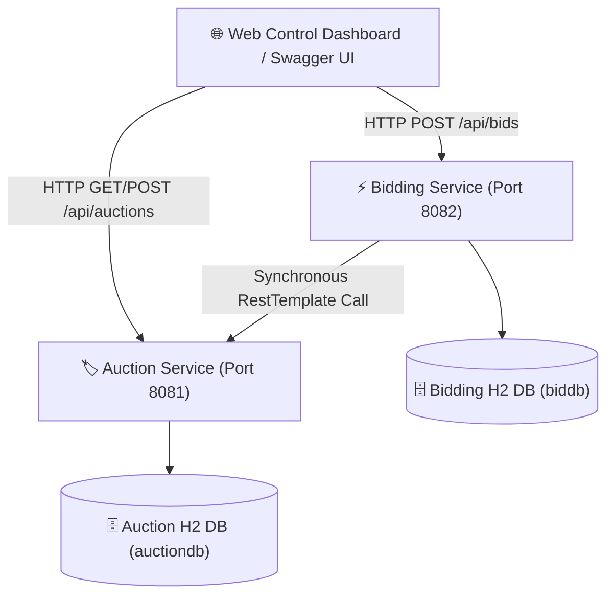

# 🏷️ Online Auction System - Microservices Architecture


An **Interview-Ready, Beginner-Friendly Spring Boot + Java** backend application built with a **Decoupled 2-Microservice Architecture**. 

Designed specifically to demonstrate core backend engineering concepts during placement interviews, including synchronous REST inter-service communication, optimistic concurrency locking (`@Version`), input validation, global exception handling, and database isolation.

---

## 📐 High-Level Architecture (HLD)



---

## 🌟 Microservices Breakdown

### 1. `auction-service` (Port 8081)
- **Role**: Manages item catalog, starting prices, seller details, item status lifecycle (`ACTIVE`, `ENDED`), and highest bid state.
- **Database**: H2 In-Memory (`jdbc:h2:mem:auctiondb`).
- **Features**: Pre-seeded with realistic sample items on startup (`data.sql`), JPA Optimistic Locking (`@Version`), and automatic expiration status updates.
- **Swagger Docs**: `http://localhost:8081/swagger-ui.html`

### 2. `bidding-service` (Port 8082)
- **Role**: Handles bid placement requests, bid validation engine, and bid history audit trail.
- **Inter-Service Communication**: Uses Spring `RestTemplate` to query `auction-service` for item details and update highest bid state synchronously.
- **Database**: H2 In-Memory (`jdbc:h2:mem:biddb`).
- **Swagger Docs**: `http://localhost:8082/swagger-ui.html`

### 3. `dashboard` (Interactive Web UI)
- Single-page glassmorphic frontend (`dashboard/index.html`) to visually demonstrate live bidding, auction listing, service health badges, and audit trails during live interview presentations.

---

## 🛠️ Tech Stack & Dependencies

- **Language**: Java 17 (OpenJDK)
- **Framework**: Spring Boot 3.2.5 (Spring Web starter, Spring Data JPA, Jakarta Validation)
- **Database**: H2 In-Memory Database
- **API Documentation**: OpenAPI / Springdoc Swagger UI
- **Build Tool**: Apache Maven (with `mvnw.cmd` Maven Wrapper included)
- **Frontend**: Vanilla HTML5, Modern CSS (Glassmorphism), JavaScript (Fetch API)

---

## 🚀 How to Run the Project (Step-by-Step)

### Prerequisites:
- Java 17 installed
- Git

### Step 1: Run `auction-service` (Port 8081)
Open a terminal:
```bash
cd auction-service
# Windows:
mvnw.cmd spring-boot:run
# Mac/Linux:
./mvnw spring-boot:run
```

### Step 2: Run `bidding-service` (Port 8082)
Open a **second terminal**:
```bash
cd bidding-service
# Windows:
mvnw.cmd spring-boot:run
# Mac/Linux:
./mvnw spring-boot:run
```

### Step 3: Open the Web Dashboard
Simply double-click `dashboard/index.html` or open it in your browser!

---

## 📡 API Endpoints Reference

### Service 1: `auction-service` (Port 8081)

| HTTP Method | Endpoint Path | Description | Sample Body JSON |
| :--- | :--- | :--- | :--- |
| `GET` | `/api/auctions` | List all auction items | N/A |
| `GET` | `/api/auctions/{id}` | Get single item details | N/A |
| `POST` | `/api/auctions` | Create new auction item | `{"title":"Rolex Watch","startingPrice":5000,"sellerName":"Alice"}` |
| `PUT` | `/api/auctions/{id}/highest-bid` | Update highest bid | `{"amount":5500,"bidderName":"Bob"}` |

### Service 2: `bidding-service` (Port 8082)

| HTTP Method | Endpoint Path | Description | Sample Body JSON |
| :--- | :--- | :--- | :--- |
| `POST` | `/api/bids` | Place a bid on an item | `{"auctionId":1,"bidderName":"Bob","amount":5500}` |
| `GET` | `/api/bids/auction/{id}`| List all bids for item | N/A |
| `GET` | `/api/bids` | Get complete bid history | N/A |

---

## 🎯 Placement Interview Q&A Cheat Sheet

When an interviewer asks you about this project, use these exact structured answers:

### Q1: Can you explain the architecture of your project?
> **Answer**: "I built an Online Auction System divided into 2 decoupled microservices: `auction-service` (port 8081) and `bidding-service` (port 8082). `auction-service` manages item listings and status lifecycle, while `bidding-service` manages bid submissions and validation rules. They communicate synchronously over REST using Spring's `RestTemplate` client. Each service has its own isolated database domain following the Database-per-Microservice pattern."

---

### Q2: How do you handle two users bidding on the same item at the exact same millisecond (Race Condition)?
> **Answer**: "I implemented **Optimistic Locking** using Spring Data JPA's `@Version` field on the `AuctionItem` entity. When two concurrent transactions read version 1 and attempt to update the row, the first transaction succeeds and increments the version to 2. The second transaction fails with an `OptimisticLockingFailureException` because version 1 no longer matches. In production, we can complement this with Redis Distributed Locking or Pessimistic DB Locking (`SELECT ... FOR UPDATE`)."

---

### Q3: Why separate into two microservices instead of a monolithic application?
> **Answer**: 
> 1. **Scalability**: Bidding traffic is typically 100x higher than item creation traffic. Separating `bidding-service` allows scaling bid processing instances independently.
> 2. **Single Responsibility**: `auction-service` focuses on item catalog management, while `bidding-service` focuses on high-throughput bid processing.
> 3. **Fault Isolation**: If `bidding-service` experiences high load, `auction-service` item catalog viewing remains responsive.

---

### Q4: Why use DTOs instead of exposing Database Entities directly in API controllers?
> **Answer**:
> 1. **Security**: Avoids Over-Posting / Mass Assignment vulnerabilities (e.g. users modifying internal fields like `version` or `id`).
> 2. **Decoupling**: Allows DB schema to change without breaking external REST API client contracts.
> 3. **Performance**: Only serializes required fields to JSON instead of huge object trees.

---

### Q5: How do you handle errors across microservices?
> **Answer**: "I used `@RestControllerAdvice` for centralized global exception handling in both microservices. It intercepts exceptions like `IllegalArgumentException` or `MethodArgumentNotValidException` and transforms them into standardized JSON error responses with HTTP status codes like `400 Bad Request` or `404 Not Found`."

---

### Q6: How would you scale this system for enterprise production?
> **Answer**:
> 1. **Service Discovery & API Gateway**: Add Spring Cloud Eureka and Spring Cloud Gateway for dynamic routing and load balancing.
> 2. **Asynchronous Messaging**: Replace synchronous `RestTemplate` calls with Apache Kafka / RabbitMQ event publishing (`BidPlacedEvent`) for high throughput.
> 3. **Caching**: Put Redis in front of `auction-service` to cache active item details and reduce DB read IOPS.
